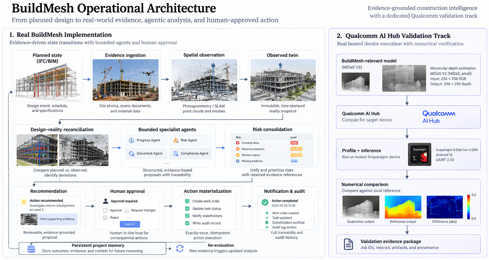
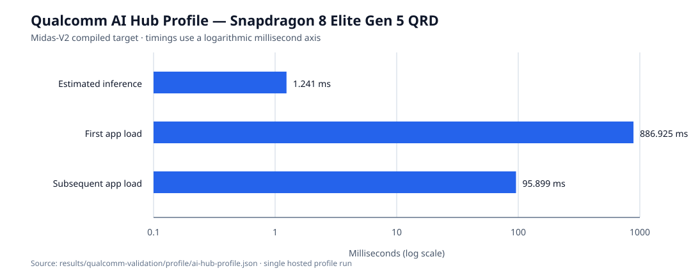
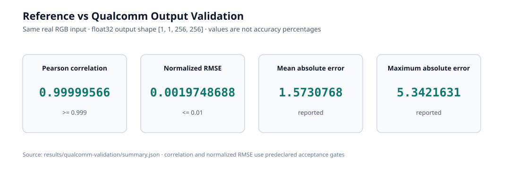

# BuildMesh

BuildMesh is a bounded construction intelligence layer that connects planned BIM/IFC state, observed reality, evidence, project risk, and human-approved operational actions. It is an auditable backend: inputs and model outputs are evidence, agents make structured proposals, and consequential changes require human approval.



## What BuildMesh Does

BuildMesh receives project updates, documents, site observations, and bounded external context; stores provenance in a SQLite project graph; reconciles planned and observed state; then produces evidence-backed recommendations. An approved recommendation can materialize one task/action atomically and retain its audit trail for later re-evaluation.

It does not claim autonomous construction management, engineering approval, safety certification, or complete digital-twin reconstruction.

## Why This Matters

Construction decisions become difficult to audit when plans, observations, model outputs, and operational actions are disconnected. BuildMesh makes the links explicit: an observation is not accepted as project truth without provenance, a recommendation names its evidence, and a proposed action cannot bypass review.

## Architecture

The architecture diagram separates the operational core from the hosted Qualcomm validation path. Qualcomm validation supplies **validation evidence only**; it does not become authoritative project state or replace the local QNN deployment boundary.

## What We Actually Built

| Capability | BuildMesh status |
| --- | --- |
| IFC ingestion with source-hash provenance | **REAL BUILDMESH IMPLEMENTATION** |
| Evidence/provenance graph and immutable observed snapshots | **REAL BUILDMESH IMPLEMENTATION** |
| Observed twin and design–reality reconciliation | **REAL BUILDMESH IMPLEMENTATION** |
| Spatial capture adapter | **REAL BUILDMESH IMPLEMENTATION** |
| External real-world spatial validation | **REAL PUBLIC INPUT** + **DERIVED SPATIAL OUTPUT** |
| Bounded specialist agents, risk consolidation, recommendation | **REAL BUILDMESH IMPLEMENTATION** |
| Human approval and exactly-once action materialization | **REAL BUILDMESH IMPLEMENTATION** |
| Qualcomm AI Hub MiDaS validation | **LIVE QUALCOMM VALIDATION** |
| Deterministic demos and RoomPlan-style inputs | **SYNTHETIC FIXTURE** |
| Physical Apple RoomPlan capture | **UNVERIFIED** |
| Construction-grade reconstruction or engineering certification | **UNSUPPORTED** |

## End-to-End Flow

```text
planned IFC / project state + evidence / observation
  -> provenance-preserving project graph
  -> observed snapshot and design–reality reconciliation
  -> bounded specialist agents and risk consolidation
  -> recommendation -> human approval -> exactly-once action -> audit -> re-evaluation
```

Agent outputs are data, not instructions. The API validates untrusted model/provider output before it becomes evidence; recommendations retain supporting evidence; approved actions are persisted atomically and idempotently.

## Real-World Validation

**REAL PUBLIC INPUT:** the external spatial validation uses a public TUM RGB-D `freiburg1_xyz` sequence. The original media is not committed.

**DERIVED SPATIAL OUTPUT:** a local PyCOLMAP run produced an arbitrary-scale, semantic-`UNKNOWN` sparse-scene bounds observation. It was ingested through the existing evidence → observed snapshot → twin → reconciliation path. This does not claim LiDAR capture, Apple RoomPlan, semantic construction reconstruction, or engineering accuracy.

Read the evidence: [External Spatial Validation](results/external-spatial-validation/README.md) · [Spatial Capture Specification](docs/buildmesh-spec/spatial-capture.md).

## Qualcomm AI Hub Validation

**LIVE QUALCOMM VALIDATION:** a BuildMesh-relevant depth model, MiDaS V2 / MiDaS_small, was compiled, profiled, and inferred through Qualcomm AI Hub on a hosted Snapdragon 8 Elite Gen 5 QRD (Android 16). The catalog-compatible asset records QAIRT `2.50.0.260828221209`; AI Hub produced a TFLite target. This validation model does not replace the repository's separately documented local YOLO/QNN deployment target.

| Stage | Result | Evidence |
| --- | --- | --- |
| Compilation | PASS | [`jpe7z89v5`](https://workbench.aihub.qualcomm.com/jobs/jpe7z89v5/) |
| Profiling | PASS | [`jpxl43vlp`](https://workbench.aihub.qualcomm.com/jobs/jpxl43vlp/) |
| Hosted inference | PASS | [`jgnzno2qg`](https://workbench.aihub.qualcomm.com/jobs/jgnzno2qg/) |
| Numerical validation | PASS | shape match; correlation and normalized-RMSE gates passed |

The reference and hosted output were both float32 `[1,1,256,256]` depth tensors for the same TUM RGB frame. The acceptance policy was fixed before evaluation: equal shape, Pearson correlation >= `0.999`, and normalized RMSE <= `0.01`.





Detailed evidence: [Qualcomm Validation](results/qualcomm-validation/README.md) · [Methodology](docs/qualcomm/methodology.md) · [Implementation](docs/qualcomm/implementation.md) · [Model selection](docs/qualcomm/model-selection.md).

## Results At A Glance

| Measurement | Observed value |
| --- | --- |
| Qualcomm estimated inference time | 1.241 ms |
| First app load | 886.925 ms |
| Subsequent app load | 95.899 ms |
| Profile compute unit | NPU (returned operator detail) |
| Pearson correlation | 0.99999566 |
| Normalized RMSE | 0.00197487 |
| MAE / maximum absolute error | 1.5730768 / 5.3421631 |

These are measurements from one hosted AI Hub profile/inference run, not an end-to-end BuildMesh benchmark, speedup claim, or accuracy percentage. The source values, raw profile artifact, checksums, job IDs, and comparison policy are in [the validation package](results/qualcomm-validation/summary.json).

## Test Coverage

Current repository verification snapshot:

| Verification class | Current result |
| --- | --- |
| Unit/integration pytest suite | 118 passed |
| External spatial + Qualcomm offline tests | 15 collected (10 external spatial, 5 Qualcomm) |
| Evaluator scenarios | 10 total: 9 PASS, 1 PARTIAL, 0 failed |
| Live Qualcomm jobs | compile, profile, inference: all SUCCESS; QAI-001–QAI-010 PASS |
| Spec status | 98 IMPLEMENTED, 4 PARTIAL, 1 UNVERIFIED, 1 PLANNED |

The evaluator's one PARTIAL scenario is existing stale-context coverage; it is not reported as a pass. Live Qualcomm jobs are deliberately separate from ordinary pytest and require private AI Hub credentials only when re-running the live workflow.

## Evidence & Reproducibility

- [External Spatial Validation](results/external-spatial-validation/README.md) — public input provenance and derived-output boundaries.
- [Qualcomm Validation](results/qualcomm-validation/README.md) — structured live-job evidence, profile artifact, comparison, and limitations.
- [Qualcomm methodology](docs/qualcomm/methodology.md) and [implementation](docs/qualcomm/implementation.md) — reproducible credential-safe workflow.
- [Agentic Operations](docs/buildmesh-spec/agentic-operations.md) — bounded recommendation and approval behavior.
- `scripts/generate_readme_figures.py` deterministically regenerates both README charts from the recorded summary and profile artifacts; it fails if they disagree or are incomplete.

No Qualcomm credential, TUM image, model binary, or inference tensor is stored in the repository.

## Technical Differentiation

Individual ingredients already exist across BIM/IFC systems, digital twins, reality capture, construction AI progress monitoring, knowledge graphs, risk analysis, and agentic workflows. BuildMesh should not be evaluated on a claim that these ideas are individually unprecedented.

Its concrete contribution is the engineered integration and verification of those capabilities into one bounded, evidence-grounded operational architecture:

- Evidence-grounded state transitions: planned state → observed state → reconciliation → operational proposal.
- Provenance-preserving reasoning: agents retain evidence references rather than assert unsupported conclusions.
- Bounded agents: structured proposals cannot bypass trusted persistence or human approval.
- Governance boundary: recommendations are distinct from consequential action.
- Exactly-once action materialization: approved actions are persisted idempotently.
- Persistent operational memory: actions and evidence feed later re-evaluation.
- Spatial-to-operational bridge: spatial evidence can inform reconciliation, risk, recommendations, and workflows rather than remaining an isolated visualization.
- Hardware evidence: a relevant model was actually compiled, profiled, and inferred on a hosted Qualcomm device with numerical reference comparison.

## Existing Landscape

Related work and products already cover AI + BIM progress monitoring, construction digital twins, multi-agent BIM/digital-twin research, knowledge-graph planning, reality-capture monitoring, and robot-ready construction twins. BuildMesh should therefore be evaluated on its concrete architecture, implementation, evidence model, governance boundaries, reproducibility, and validation results rather than on a claim that these concepts are individually unprecedented.

## Limitations

- **UNVERIFIED:** physical iPhone/iPad LiDAR / Apple RoomPlan capture has not been demonstrated.
- **UNSUPPORTED:** no construction-grade reconstruction, semantic construction twin, engineering certification, or safety claim is made.
- **UNVERIFIED:** the local Windows Snapdragon QNN deployment path has implementation and evidence gates, but this repository does not present a local target-device benchmark.
- The hosted Qualcomm values are single-run validation evidence, not a product-wide performance or accuracy comparison.
- CAD/BIM geometry-engine behavior, production access control, and additional production data/model validation remain future work.

## Quick Start

```bash
git clone <repository-url>
cd buildmesh
python -m venv .venv
. .venv/bin/activate                  # Windows: .venv\Scripts\activate
pip install '.[dev]'
pytest -q
buildmesh evaluate --scenario all --json
buildmesh --database ./buildmesh.db demo
buildmesh --database ./buildmesh.db serve
```

Open `http://127.0.0.1:8000` for the local workspace or `http://127.0.0.1:8000/docs` for the API. Inspect `results/` without any external credentials. Re-running live Qualcomm validation is optional and requires an already configured AI Hub account; offline evidence checks do not.

For the optional local Snapdragon/QNN target, see [qualcomm-deployment.json](src/buildmesh/qualcomm-deployment.json). The runtime refuses to claim NPU execution when QNN/device evidence is unavailable.

## Repository Structure

```text
src/buildmesh/                       application and bounded-agent runtime
tests/                               unit, integration, spatial, and offline validation tests
docs/buildmesh-spec/                 architecture and behavior specifications
docs/qualcomm/                       AI Hub implementation and methodology
docs/assets/                         BuildMesh-owned architecture SVG
results/external-spatial-validation/ public-input/derived-output evidence
results/qualcomm-validation/         live Qualcomm evidence and generated figures
scripts/                             reproducible validation and figure generators
```

## License

BuildMesh is licensed under the [MIT License](LICENSE).
